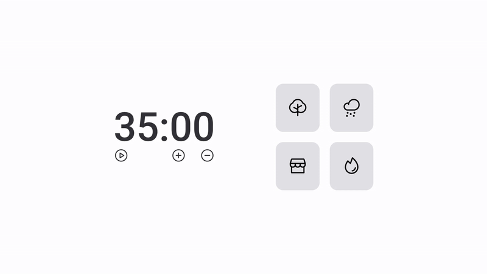

# Focus Timer

> Projeto desenvolvido como desafio do Curso Explorer da Rocketseat. Cronometro com som ambiente 

### Tecnologias usadas

O projeto utiliza as seguintes tecnologias:
    
- HTML
- CSS
- JavaScript
